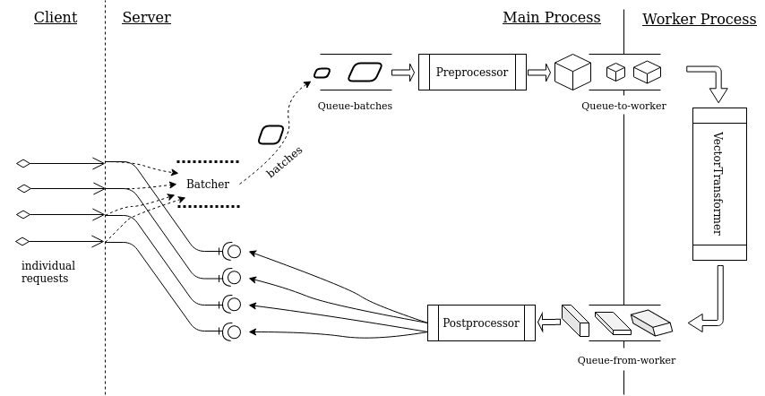

TensorFlow Serving has "batching" capability because the model inference can be "vectorized".
This means that if you let it predict `y` for `x`, versus one hundred `y`s for one hundred `x`s, the latter may not be much slower than the former (definitely *much* better than one hundred times slower),
because the algorithm takes the batch and performs fast matrix computation, or even sends the job to GPU for very fast parallel computation.
The effect is that the batch may take somewhat longer than a single element,
but per-item time is *much* shorter, hence *throughput* is much higher.<!--excerpt-->

As a model service, this does not require the client to send a batch of `x` at a time.
Instead, the client sends individual items as usual.
The server collects these requests but does not do the real processing right away
until a certain amount has been accumulated or a pre-determined waiting-time is up.
At that point, the server processes the batch of input, gets a batch of results,
and distributes individual responses (out of the batch result) to the waiting requests.
Obviously, it has to make sure that things are in correct order, for example,
the second request should not get the result that is for the first request.

This is a common need in machine learning services.
What if TensorFlow Serving is not applicable for the particular situation?
In this post, we'll design such a server in Python using only the standard library.
Although we'll use machine-learning terminology like "model" and "inference",
the idea and code are general.

## Overall design

We're going to develop a class `BatchedService` for this purpose.
The "core" vectorized model is a class named `VectorTransformer`.
A high-level design decision is to let `VectorTransformer` run in a separate process,
so that the main process concentrates on handling requests from the client,
including receiving, batching, preprocessing, dispatching results to waiting requests, and so on.
This multiprocess structure allows the logistics in the main process to happen in parallel to the "real work" of the `VectorTransformer`, which is compute-intensive.
(By the way I dislike the fashion of using "compute" as a noun, but there's nothing I can do about it...)

We may as well show the architecture up front and explain below.



As individual requests come in, a "batcher" collects them and holds them in a buffer.
Once the buffer is full or waiting-time is over (even if the buffer is not yet full), the content of the buffer will be placed in a queue (`queue-batches`). The unit of the data in the queue is "batch", or basically a `list` of individual requests.
`Preprocessor` takes a batch at a time out of the queue, does whatever preprocessing it needs to do, and puts the preprocessed batch in a queue (`queue-to-worker`) that is going through the process boundary. The worker process takes one batch at a time out of this queue, makes predictions for this batch by the vectorized model, i.e. `VectorTransformer`, and puts the result in another queue (`queue-from-worker`). Back in the main process, a `Postprocessor` takes one result batch at a time off of this queue, does whatever postprocessing it needs to do, and critically, unpack the batch and distributes individual results to the individual requests, which have been waiting.

It's useful to highlight that

- In the "worker process", execution is sequential.
- In the main process, the parts before `queue-to-worker` and after `queue-from-worker` are concurrent.
- The work between `queue-batches` and `queue-to-worker` is sequential.
- The jobs of the `Batcher` and `Preprocessor` are concurrent. If preprocessing is anything expensive, collection of new requests should continue as one batch is being preprocessed.
- The `Preprocessor` put things in two queues: `queue-to-worker` is consumed by the worker process, whereas `queue-future-results` is consumed by `Postprocessor`.
- There must be a mechanism for `Postprocessor` to pair each individual result with its corresponding request. The diagram suggests that this is accomplished by `queue-future-results`. The "lollypop symbols" pulled out of the queue turn out to be objects of type `asyncio.Future`. The queue guarantees these `Future` objects come in order consistent with the elements in `queue-batches`, `queue-to-worker` and `queue-from-worker`. In the meantime, each original request also holds a reference of its corresponding `Future` object. We'll come back to this point later.

Now let's code up this design.


## The worker process

The processsing in the worker process is simple sequential code, so we'll tackle that first.

```python
import asyncio
import multiprocessing as mp
from abc import ABCMeta
from typing import Dict, List, Type


class VectorTransformer(metaclass=ABCMeta):
    # Subclasses should define `__init__` to receive
    # necessary info. Ideally, parameters to `__init__`
    # are simple, built-in types such as numbers and strings.

    def preprocess(self, x: List) -> 'preprocessed':
        # This method takes the data from the main process
        # and prepares it for `transform`.
        return x

    @abstractmethod
    def transform(self, x: 'preprocessed') -> 'transformed':
        # This is a "vectorized" function
        raise NotImplementedError

    def postprocess(self, pre: 'preprocessed', trans: 'transformed') -> 'postprocessed':
        # This method takes the outputs of `preprocess` and `transform`
        # and returns something that will be sent back to the main process
        # in a queue.
        # The output of this method must be pickleable.
        #
        # In typical situations, this method only needs `trans`, but the output
        # of `preprocess` (i.e. the input to `transform`) is also provided
        # just in case parts of it are needed in determining the return value.
        return trans

    def run(self, *, q_in: mp.Queue, q_out: mp.Queue):
        cls_name = self.__class__.__name__

        # Put a 'ready' signal in the queue.
        q_out.put(None)

        while True:
            x = q_in.get()
            y = self.preprocess(x)
            z = self.transform(y)
            w = self.postprocess(y, z)
            q_out.put(w)

    @classmethod
    def start(cls, *, q_in: mp.Queue, q_out: mp.Queue, init_kwargs: Dict = None):
        transformer = cls(**(init_kwargs or {}))
        transformer.run(q_in=q_in, q_out=q_out)
```

The classmethod `VectorTransformer.start` is the `target` when we launch the worker process from the main process. This method takes only simple parameters,
and it will create an instance of `VectorTransformer`
and start an infinite loop of processing by calling the method `run` of the instance.

The core task of the worker is accomplished by the method `transform`.
This is a **vectorized** function, which takes a list of input units and create results for them at once in a some parallel or other fast way---at least that's the intention.
User must subclass `VectorTransform` and implement their specific `transform`.
`VectorTransformer` also allows preprocessing and postprocessing before and after `transform`. By default, these are simple pass-throughs, and that may be enough for simple scenarios. In reality, there are all kinds of special needs that can use `preprocess` and `postprocess` to take of peculiarities so that the core `transform` stays clean and efficient.

As we see, `run` follows a simple, sequential flow of logic:
it takes input from a queue, run the input through `preprocess`, `transform`, and `postprocess`, and sends the output of `postprocess` back to the main process via another queue. Of course, what happens in `transform` does not have to be simple and sequential. For example, it may very well use multiple cores to do some parallel computation. However, it is important to stress that the worker processes the data in the queue in a sequential way, hence the order of the sequence is maintained.

For the sake of simplicity, we have neglected exception handling and logging.

## Starting off the main process

The main process centers on a class called `BatchedService`.
It expects several parameters controlling the behavior of batching:

- `max_batch_size`: This is the max count of individual elements
  to gather and process as a batch. We are going to maintain some kind of a "buffer" whose capacity is equal to this number. Once the buffer is full, its content will be processed for real. Before that, it is "collecting", or "batching", requests.

  For ease of narration, this one buffer-ful of content will be called a *batch*.
  This is the unit of data that goes through a number of stages after leaving the buffer.
- `timeout_seconds`: What if requests come in very slowly? Or even are on pause for a while while the buffer is not full yet? We can't wait forever on the buffer. This parameter controls how long we wait until we stop the wait and process a partial buffer. This suggests that a *batch* may be full-size or partial-size.
- `max_queue_size`: Once we've sent a batch for subsequent processing, the buffer starts collecting new requests. Maybe the buffer gets full (or times out) before the previous batch is done processing. Then a new batch enters the pipeline.
In general, there can be multiple batches in-progress in the pipeline in various stages. An upper limit of this count is `max_queue_size`. Once this is reached, the buffer is not open for new requests. New requests have to wait until the count of in-pipeline batches drops below `max_queue_size`.

The master control of the `BatchedService` class is a method called `start`:

```python
class BatchedService:

    def start(self, worker_class: Type[VectorTransformer], worker_init_kwargs: Dict = None):
        self._loop = asyncio.get_event_loop()
        print('Starting %s ...' % self.__class__.__name__)

        p_worker = mp.Process(
            target=worker_class.start,
            kwargs={
                'q_in': self._q_to_worker,
                'q_out': self._q_from_worker,
                'init_kwargs': worker_init_kwargs,
            },
            name=f'{worker_class.__name__}-process',
        )
        p_worker.start()
        _ = self._q_from_worker.get()
        # Consume the 'ready' signal.

        self._p_worker = p_worker
        self._t_preprocessor = self._loop.create_task(self._run_preprocess())
        self._t_postprocessor = self._loop.create_task(self._run_postprocess())
        print('%s is ready to serve' % self.__class__.__name__)

    async def _run_preprocess(self):
        # to be implemented

    async def _run_postprocess(self):
        # to be implemented
```

The parameter `worker_class` is a subclass of `VectorTransformer`.
Note that it is the class object itself, not a class instance.

The attributes `self._q_to_worker` and `self._q_from_worker` represent the queues "Queue-to-worker" and "Queue-from-worker", respectively, in the architecture diagram. They are responsible for passing data to and receiving results from the worker process.

This method starts the worker process, and sets up the "Preprocessor" and "Postprocessor" as shown in the diagram. All these three components stay in infinite loops, waiting to receive and process requests.

This starts off pretty good. The bad news is, this is all the low-hanging fruit there is. Next, we have to tackle the tricky part---batching.

## Request batching---the first part

Batching is accomplished by two parts in coordination.
The first part happens before data is sent to the worker process.
The second part happens, well, after result is received from the worker process.
We'll explain the first part in this section. The main players in this part are four functions:

```python
class BatchedService:

    async def _run_preprocess(self):
        # to be implemented

    def _submit_batch(self):
        # to be implemented

    async def _submit_one(self, x):
        # to be implemented

    async def do_one(self, x):
        fut = await self._submit_one(x)
        return await fut
```

The method `do_one` is the user-facing entry point; in other words, it's the API.
This method submits a single data element, `x`, and obtains an `asyncio.Future` object. It then waits on this object until it contains result.
Note that this function is *async*, meaning other data elements may call this function again while a previous call to it is awaiting result.
The different calls are independent of each other. They are *async* and *concurrent*.

The methods `_submit_one` and `_submit_batch` constitute the "Batcher" in the diagram.

`_submit_one` puts `x` in the internal "buffer" mentioned above.
Once the buffer is full, it calls `_submit_batch` to put the content of the buffer
in the "Queue-batches". Remember that it can't just wait for the buffer to fill up. It also needs to set up a callback, which happens to be `_submit_batch`, to fire up in certain time. Finally, it creates a `Future` object to hold the result, once it's available in a later time, and resturns the `Future` to `do_one`.

By now we have touched on most of the internal variables that need to be maintained, hence we're ready to list the `__init__` method:

```python
class BatchedService:
    def __init__(
        self,
        max_batch_size: int,
        timeout_seconds: float = 0.1,
        max_queue_size: int = 32,
    ):
        assert 1 <= max_batch_size <= 10000
        assert 0 < timeout_seconds <= 1
        assert 1 <= max_queue_size <= 128

        self.max_batch_size = max_batch_size
        self.max_queue_size = max_queue_size
        self.timeout_seconds = timeout_seconds

        self._batch = [None for _ in range(max_batch_size)]
        self._batch_futures = [None for _ in range(max_batch_size)]
        self._batch_len = 0
        self._submit_batch_timer = None

        self._q_batches = asyncio.Queue(max_queue_size)

        self._q_future_results = asyncio.Queue()

        self._q_to_worker = mp.Queue(max_queue_size)
        self._q_from_worker = mp.Queue(max_queue_size)

        self._p_worker = None
        self._t_preprocessor = None
        self._t_postprocessor = None

        self._loop = None
```

Of the instance variables,

- `_batch`: contains input data elements (the parameter `x` to `do_one`).
- `_batch_futures`: contains `asyncio.Future` objects corresponding to the data elements in `_batch`.
- `_q_batches`: "Queue-batches" in the diagram.
- `_q_future_results`: "Queue-future-results" in the diagram; contains the `asyncio.Future` objects after the "Preprocessor" has preprocessed the batches; the `Future` objects will be picked up by the "Postprocessor".

Take a note that `_q_batches`, `_q_to_worker`, and `q_from_worker` have limited capacity.

Now let's implement `_submit_one`:

```python
class BatchedService:

    async def _submit_one(self, x):
        while self._batch_len >= self.max_batch_size:
            # Buffer is not ready to receive new request. Wait and retry.
            await asyncio.sleep(self.timeout_seconds * 0.02)

        # Put request in buffer.
        # Create corresponding Future object.
        self._batch[self._batch_len] = x
        fut = self._loop.create_future()
        self._batch_futures[self._batch_len] = fut
        self._batch_len += 1

        if self._batch_len == self.max_batch_size:
            self._submit_batch()
        elif self._batch_len == 1:
            self._submit_batch_timer = self._loop.call_later(
                self.timeout_seconds,
                self._submit_batch,
            )
        else:

            pass

        return fut
```

The data element `x` and the corresponding `Future` object are put in `_batch` and `_batch_futures`, respectively, at the same index.
After this, if the batch reaches capacity, the method `_submit_batch` is called immediately.
Otherwise, if it is realized that a new batch is just starting (the first element has just been inserted), a timer is started to fire the callback `_submit_batch`.

Failing both checks, we're in the middle of populating the buffer.
Nothing special needs to be done.
At a later time, the buffer will be processed
either when it is full, or when the timer expires.

The callback `_submit_batch` is a regular *sync* function.
This is required by `call_later`.

```python
class BatchedService:

    def _submit_batch(self):
        if self._submit_batch_timer is not None:
            self._submit_batch_timer.cancel()
            self._submit_batch_timer = None

        if self._q_batches.full():
            self._submit_batch_timer = self._loop.call_later(
                self.timeout_seconds * 0.1,
                self._submit_batch,
            )
            return

        x = self._batch[: self._batch_len]
        fut = self._batch_futures[: self._batch_len]
        self._q_batches.put_nowait((x, fut))

        for i in range(self._batch_len):
            self._batch[i] = None
            self._batch_futures[i] = None

        self._batch_len = 0
```

This method intends to put the content of the buffer in the queue `_q_batches`.
Because the queue has a capacity limit, it could be full at the very moment.
In that case, remember `_submit_batch` is a sync (i.e., *blocking*) function, hence we can't wait there. The solution is to set a timer to call `_submit_batch` again sometime soon, and exit right away.

If `_q_batches` has room, both `_batch` and `_batch_futures` are put in the queue as a `tuple`. This ensures the input data and result `Future`s are in correspondence.
After this is done, `_batch_len` is reset to `0`, indicating to `_submit_one` that the buffer accepts new requests.

Remember that `_submit_one` checks `_batch_len < max_batch_size` to determine whether the buffer is accepting new elements.
It may very well happen that this condition holds true but `_submit_batch` is executing due to timer expiration.
This won't mess up, because `_submit_batch` is blocking, that is, `_submit_one` won't be executing at the same time.
In this execution, `_submit_batch` may find `_q_batches` to be full, hence it starts another timer and exits---while `_batch_len` stays below `max_batch_size`.
During this extended wait, `_submit_one` can continue to put elements in the batch until it is full.

By now we have put batches in a queue (`_q_batches`).
Coming next is to put them, one by one, in another queue (`_q_to_worker`) that passes data into the worker process.
This is handled by the "Preprocessor" in the diagram.

```python
class BatchedService:

    async def _run_preprocess(self):
        while True:
            x, fut = await self._q_batches.get()

            x = await self.preprocess(x)

            while self._q_to_worker.full():
                await asyncio.sleep(0.0015)
            self._q_to_worker.put(x)

            self._q_future_results.put_nowait(fut)

    async def preprocess(self, x):
        '''
        This performs transformation on a batch just before it is
        placed in the queue to be handled by the worker-process.

        The output of this method must be pickleable, because
        it is going to be sent to the worker process.
        '''
        return x
```

The design provides a hook `preprocess` for subclasses to perform transformation on the batch as needed before the batch is sent to the worker process.

In `_run_preprocessor`, the data elements and their corresponding result `Futures` part ways: the former go to `_q_to_worker` destined for the worker process, whereas the latter go to `_q_future_results`, which "stays" in the main process.
Batches in `_q_to_worker` are to be processed in sequence in the worker process, and will come back out of `_q_from_worker` in the same order.
In the meantime, the `Future` elements are put in `_q_future_results` in the same order,
and they will be picked up by the "Postprocessor" in the same order.
All in all, the input data, the results, and the `Future` objects that will receive the results, stay coordinated in the same, correct order.

## Request batching---the second part

```python
class BatchedService:

    async def _run_postprocess(self):
        while True:
            while self._q_from_worker.empty():
                await asyncio.sleep(0.0018)

            result = self._q_from_worker.get()
            await asyncio.sleep(0)

            result = await self.postprocess(result)

            # Get the future 'box' that should receive this result.
            # The logic guarantees that things are in correct order.
            future = self._q_future_results.get_nowait()

            for f, r in zip(future, result):
                    f.set_result(r)

            # The Future objects are referenced in the originating requests,
            # hence the `future` and `f` here are a second reference.
            # Going out of scope here will not destroy the object.
            # Once the waiting request has consumed the corresponding Future object
            # and returned, the Future object will be garbage collected.

    async def postprocess(self, x):
        '''
        This performs transformation on the result obtained from the queue,
        which has been placed in there by the worker process.
        This transformation happens in the current process.

        If you override this method, remember it must be `async`.
        '''
        return x
```

## Finishing off

```python
    def stop(self):
        logger.info('Stopping %s ...', self.__class__.__name__)
        if not self._t_preprocessor.done():
            self._t_preprocessor.cancel()
        if self._p_worker.is_alive():
            self._p_worker.terminate()
        if not self._t_postprocessor.done():
            self._t_postprocessor.cancel()
        logger.info('%s is stopped', self.__class__.__name__)

    def __del__(self):
        self.stop()
```

## Putting it to test
